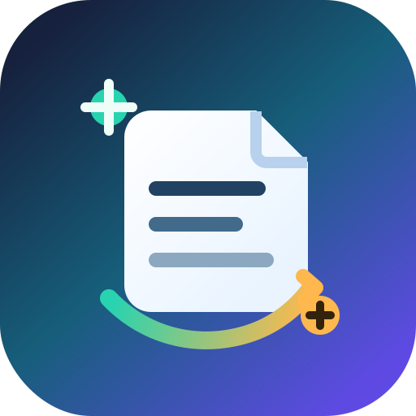
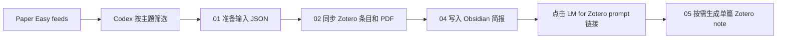
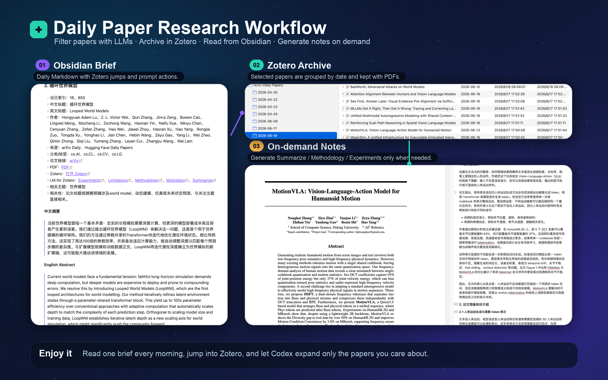

<p align="center">
  
</p>

<h1 align="center">Daily Paper Research Workflow</h1>

<p align="center">
  <strong>一个可复现的 Codex + Paper Easy + Zotero + Obsidian 每日论文工作流，把每日论文流变成可行动的研究简报。</strong>
</p>

<p align="center">
  <a href="README.md">English</a>
  ·
  <a href="docs/AI_INSTALL.md">AI 安装指南</a>
  ·
  <a href="docs/INSTALL.md">人工安装</a>
  ·
  <a href="docs/WORKFLOW.md">流程说明</a>
  ·
  <a href="docs/SECURITY.md">安全说明</a>
</p>

<p align="center">
  <a href="https://github.com/YanxingLiu/daily-paper-research-workflow"></a>
  
  
  
</p>

## 为什么做这个项目

每日论文 feed 很有用，但噪声也很大。这个仓库打包了一套我自己在用的工作流：

- 通过 Paper Easy 读取每日 arXiv 和 Hugging Face Daily Papers；
- 只让 Codex 负责最主观的一步：按主题筛选论文；
- 用确定性脚本把命中论文和 PDF 同步到 Zotero；
- 生成格式稳定的 Obsidian Markdown 每日简报；
- 在简报里放按需触发的 LM for Zotero note 链接，而不是一开始就把所有论文都总结一遍。

目标不是让 AI 替你判断论文价值，而是减少重复筛论文、搬链接、建 Zotero 条目、写固定格式简报这些机械工作。真正的阅读和判断仍然留给你。

## 仓库内容

| 路径 | 作用 |
| --- | --- |
| `paper-easy/` | Paper Easy 服务源码，提供 arXiv/Hugging Face 缓存和 MCP endpoint。 |
| `plugins/paper-easy-codex-plugin/` | Codex 读取 Paper Easy MCP 的插件。 |
| `plugins/codex-obsidian/` | Codex Obsidian 插件 submodule，指向 `YanxingLiu/codex-obsidian`。 |
| `plugins/openai-plugins/` | OpenAI plugins monorepo submodule；Zotero 插件位于 `plugins/openai-plugins/plugins/zotero`。 |
| `automation/` | 确定性流水线脚本、LM for Zotero prompts 和示例输入。 |
| `scripts/` | 初始化、插件安装、Paper Easy 启动、macOS URL handler 安装脚本。 |
| `docs/` | 安装、AI 安装、工作流和安全说明。 |

## 工作流



默认关注主题：

- 世界模型
- 具身智能
- 空间记忆
- 多模态大语言模型

如果你要改关注方向，修改 Codex 自动化 prompt 和输入 JSON 里的 `topics` 即可。

## 快速开始

当前主要面向 macOS，因为按需生成 note 使用了自定义的 `daily-paper-note://` URL handler。

```bash
git clone --recurse-submodules https://github.com/YanxingLiu/daily-paper-research-workflow.git
cd daily-paper-research-workflow

./scripts/bootstrap.sh
eval "$(./scripts/print_paper_easy_token.sh)"
./scripts/install_codex_plugins.sh
./scripts/install_note_url_handler.sh
./scripts/run_paper_easy.sh
```

`run_paper_easy.sh` 会启动本地 Paper Easy：`http://127.0.0.1:5174`，并占用当前终端。之后另开一个 Codex 会话，让 Codex 按 `docs/CODEX_DAILY_AUTOMATION_PROMPT.md` 执行每日任务。

如果你希望让 Codex 直接帮你安装本工作流，可以让它先阅读：

```text
docs/AI_INSTALL.md
```

这份文档是专门写给 AI coding agent 的安装 playbook。

## Paper Easy 后端选择

### 方案 A：本地部署 Paper Easy

长期使用推荐本地部署。这样可以稳定刷新缓存，按自己的方向配置 arXiv/Hugging Face 数据源，也不依赖我的机器。

默认端点：

- Web: `http://127.0.0.1:5174`
- MCP: `http://127.0.0.1:5174/mcp`

### 方案 B：使用 hosted 只读 Paper Easy

如果你不想本地部署爬取 arXiv 论文的 Paper Easy，可以试用我部署好的实例：

```text
https://paper-easy.liuyanxing.site:8443/
```

只读工具无需 admin token。需要注意的是，我临近毕业搬家，主机可能会搬走，所以这个 hosted 服务不保证长期可用。

切换 Codex 插件到 hosted 只读 MCP：

```bash
cp plugins/paper-easy-codex-plugin/.mcp.hosted.example.json \
  plugins/paper-easy-codex-plugin/.mcp.json
./scripts/install_codex_plugins.sh
```

hosted 模式适合快速试用：

- `get_arxiv_daily_papers`
- `get_arxiv_author_papers`
- `get_huggingface_daily_papers`

如果你需要稳定刷新缓存或自定义抓取配置，请使用本地部署。

## 外部依赖

- Node.js 20+ 和 npm
- Python 3.11+
- Codex CLI / Codex 桌面环境
- Zotero Desktop，并启用本地 API
- Zotero Connector
- Better BibTeX for Zotero
- [llm-for-zotero](https://github.com/yilewang/llm-for-zotero)
- [OpenAI Zotero Codex plugin](https://github.com/openai/plugins/tree/main/plugins/zotero)，本仓库通过 `plugins/openai-plugins` submodule 引入
- [Codex Obsidian plugin](https://github.com/YanxingLiu/codex-obsidian)，本仓库通过 `plugins/codex-obsidian` submodule 引入
- Obsidian，可选安装官方 Obsidian CLI

## 生成的简报



最终 Markdown 简报包含两个主小节：

1. 感兴趣论文
2. Hugging Face Daily Papers

感兴趣论文会包含：

- 中英文标题
- 可用时的中英文摘要
- arXiv/PDF 链接
- Zotero 深链
- 按需触发的 `LM for Zotero` prompt 链接，例如 `Summarize`、`Methodology`、`Experiments`、`Limitations`

最终 Markdown 由 `automation/outputs/04_daily_paper_brief.py` 生成，不应该由 agent 手写。

## 安全边界

这个仓库故意不包含：

- 真实 `.env`
- API key 或 admin token
- Paper Easy SQLite 数据库
- Zotero SQLite 数据库
- 本地 PDF 或 Zotero attachment
- 生成的 `automation/work/` 输出
- 生成的 note Markdown artifact

Zotero 相关写入不直接修改 Zotero SQLite，而是通过 Zotero Connector、本地 API、Better BibTeX helper 和 LM for Zotero runtime script 等受支持的路径完成。

完整说明见 [docs/SECURITY.md](docs/SECURITY.md)。

## 文档

- [AI 安装指南](docs/AI_INSTALL.md)：给 Codex 或其他本地 coding agent 看的安装说明。
- [人工安装指南](docs/INSTALL.md)：给人看的安装说明。
- [每日自动化 prompt](docs/CODEX_DAILY_AUTOMATION_PROMPT.md)：每日任务使用的 prompt。
- [工作流细节](docs/WORKFLOW.md)：按脚本拆开的流程说明。
- [安全说明](docs/SECURITY.md)：token、artifact 和 Zotero 写入边界。
